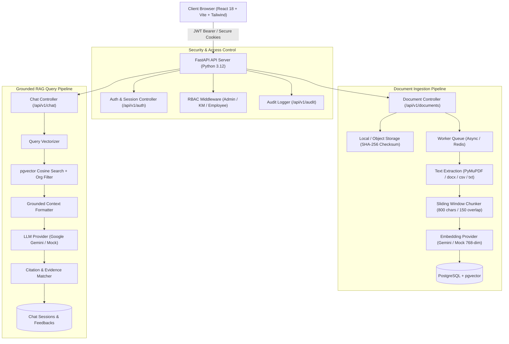
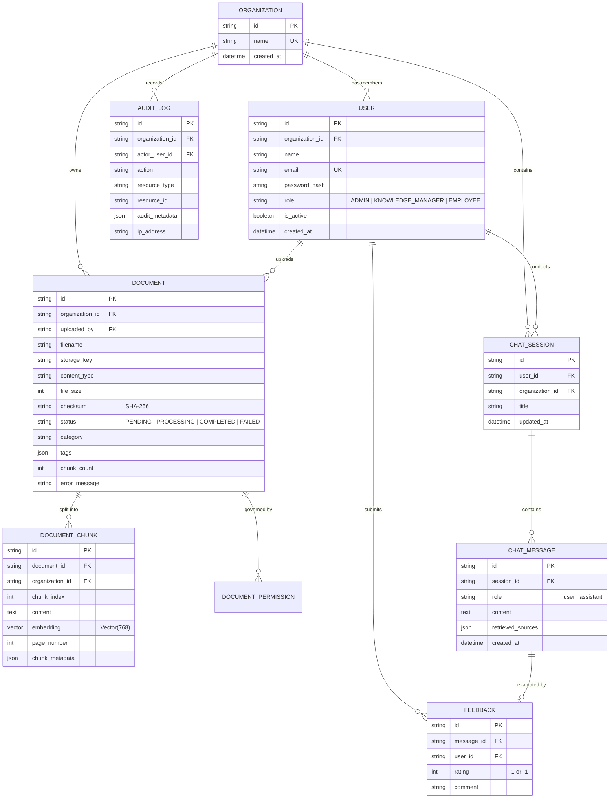
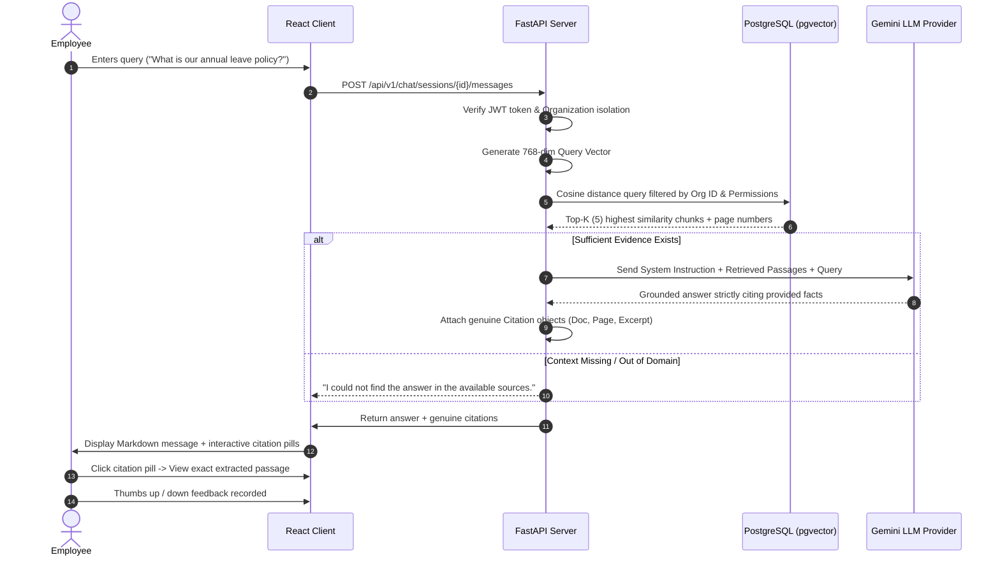

# Enterprise AI Knowledge Assistant

> Production-ready, grounded Retrieval-Augmented Generation (RAG) platform with multi-tenant data isolation, role-based access control (RBAC), pgvector semantic search, and verifiable source citations.

[](https://fastapi.tiangolo.com)
[](https://python.org)
[](https://github.com/pgvector/pgvector)
[](https://react.dev)
[](https://www.typescriptlang.org)
[](https://tailwindcss.com)
[](https://docker.com)
[](https://opensource.org/licenses/MIT)

---

## 📌 Repository Description (Under 350 Characters)
> Enterprise AI Knowledge Assistant is a production-grade full-stack RAG platform with FastAPI, React, PostgreSQL/pgvector, and Google Gemini. Features strict citation-grounded answers, tenant isolation, RBAC, background vector indexing, and audit logging.

---

## 1. Project Overview & Problem Statement

Modern enterprises face significant knowledge fragmentation: critical operating procedures, compliance guidelines, HR policies, and technical runbooks are scattered across disconnected PDFs, Word documents, and spreadsheets. Standard LLM chatbots fail in corporate environments due to:

1. **Hallucinations & Speculation**: Generative models invent plausible policies that do not exist.
2. **Lack of Verifiable Grounding**: Employees cannot identify the underlying page, document, or author.
3. **Data Leaks & Unauthorized Access**: Sensitive internal documents must not leak across organizational tenants or unauthorized job roles.

**Enterprise AI Knowledge Assistant** solves these challenges by combining:
* **Mathematical Evidence Grounding**: An LLM is strictly constrained to answer only from retrieved passages. If evidence is lacking, it explicitly states: *"I could not find the answer in the available sources."*
* **Verifiable Source Citations**: Every generated response includes clickable source pills with document names, page numbers, similarity match scores, and exact extracted passages.
* **Three-Tier Role-Based Access Control (RBAC)**: Backend-enforced role privileges for **ADMIN**, **KNOWLEDGE_MANAGER**, and **EMPLOYEE**.
* **Multi-Tenant Isolation**: Complete row-level and query-level isolation ensuring zero cross-organization data leakage.

---

## 2. System Architecture



---

## 3. Database Schema (Entity-Relationship Diagram)



---

## 4. End-to-End RAG Workflow



---

## 5. Technology Stack

| Layer | Technologies |
| :--- | :--- |
| **Frontend** | React 18/19, Vite, TypeScript, Tailwind CSS, React Router v6, Axios, Lucide Icons, React Markdown |
| **Backend** | Python 3.12+, FastAPI, Pydantic v2, SQLAlchemy 2.0 (Asyncio), Greenlet, Passlib (Argon2), Python-Jose |
| **Database** | PostgreSQL 16 with `pgvector` extension (with SQLite + in-memory vector fallback for zero-dependency tests) |
| **Document Parsing** | PyMuPDF (`fitz`) for PDF page extraction, `python-docx` for Word, CSV/TXT structured segmenters |
| **AI Providers** | Google Gemini (`text-embedding-004`, `gemini-1.5-flash`), OpenAI fallback, Deterministic Mock provider |
| **Background Processing** | Asynchronous worker architecture with SHA-256 duplicate detection and idempotent chunk cleanup |
| **Testing** | Pytest, Pytest-Asyncio, HTTPX ASGI Transport (22 unit, integration, and security tests) |
| **DevOps & Containers** | Docker, Docker Compose, Nginx Alpine, Multi-stage builds |

---

## 6. Project Structure

```text
Enterprise AI Knowledge Assistant/
├── backend/
│   ├── app/
│   │   ├── api/v1/           # Modular REST controllers
│   │   │   ├── auth.py       # JWT register, login, refresh rotation, logout
│   │   │   ├── users.py      # User management & RBAC role promotion
│   │   │   ├── documents.py  # File upload, chunk inspection, permissions
│   │   │   ├── chat.py       # Conversational RAG Q&A & feedback
│   │   │   ├── dashboard.py  # Realtime operational metrics
│   │   │   ├── audit.py      # Security compliance logs
│   │   │   └── router.py     # Aggregated v1 router
│   │   ├── core/             # Configuration, security, logging
│   │   ├── db/               # SQLAlchemy models & cross-dialect VectorType
│   │   ├── models/           # Normalized database entities
│   │   ├── schemas/          # Pydantic v2 request/response schemas
│   │   ├── rag/              # Document extractors, chunker, AI providers, RAG pipeline
│   │   ├── storage/          # Local & private object storage abstraction
│   │   ├── workers/          # Idempotent document ingestion & vectorization queue
│   │   └── main.py           # FastAPI entrypoint, CORS & health probes
│   ├── alembic/              # Alembic database migrations
│   ├── tests/                # Automated pytest suite
│   ├── requirements.txt      # Python dependencies
│   └── Dockerfile
├── frontend/
│   ├── src/
│   │   ├── components/       # Reusable Badge, Button, Card, Modal, CitationDrawer
│   │   ├── context/          # AuthContext and ToastContext
│   │   ├── pages/            # 12 production pages
│   │   ├── services/         # Axios API clients with auto token refresh
│   │   ├── types/            # TypeScript interfaces
│   │   ├── App.tsx           # Router & protected route guards
│   │   └── index.css         # Tailwind directives
│   ├── package.json
│   ├── tailwind.config.js
│   ├── vite.config.ts
│   └── Dockerfile
├── demo_documents/           # Sample policies for HR, Engineering, and Security
├── docker-compose.yml        # Orchestration for PostgreSQL + pgvector, Redis, Backend, Frontend
├── .env.example              # Complete configuration template
├── .gitignore
└── LICENSE                   # MIT
```

---

## 7. Getting Started

### Option A: Running with Docker Compose (Recommended for Full Stack)

1. Clone the repository:
   ```bash
   git clone https://github.com/your-username/enterprise-ai-knowledge-assistant.git
   cd "enterprise-ai-knowledge-assistant"
   ```

2. Configure environment:
   ```bash
   cp .env.example .env
   ```
   *(Optional: Add your `GEMINI_API_KEY` from Google AI Studio. If left empty, the application seamlessly uses the built-in deterministic offline mock provider).*

3. Launch all containers:
   ```bash
   docker-compose up --build
   ```

4. Seed the database with demo users and realistic documents:
   ```bash
   docker-compose exec backend python -m app.db.seed
   ```

5. Open your browser:
   * **Frontend Application**: `http://localhost:5173` (or `http://localhost:80`)
   * **Backend OpenAPI Docs**: `http://localhost:8000/docs`
   * **Health Probe**: `http://localhost:8000/health`

---

### Option B: Local Bare-Metal Development (Fastest for Testing)

#### 1. Backend Setup:
```bash
cd backend
python -m venv .venv
# On Windows:
.venv\Scripts\activate
# On Linux/macOS:
# source .venv/bin/activate

pip install -r requirements.txt
cp ../.env.example .env

# Run database seed (creates demo users & indexes demo documents)
python -m app.db.seed

# Start FastAPI server
uvicorn app.main:app --reload --port 8000
```

#### 2. Frontend Setup:
```bash
cd frontend
npm install
npm run dev
```
Navigate to `http://localhost:5173`.

---

## 8. Demo Credentials & Test Scenarios

The seed script creates a complete enterprise organization (**Acme Enterprise**) with three pre-configured accounts:

| Role | Email | Password | Allowed Capabilities |
| :--- | :--- | :--- | :--- |
| **Admin** | `admin@acme.com` | `DemoPass123!` | Full control, role assignment, audit logs, document curation |
| **Knowledge Manager** | `manager@acme.com` | `DemoPass123!` | Upload documents, inspect chunks, configure document permissions |
| **Employee** | `employee@acme.com` | `DemoPass123!` | Ask questions, review citations, submit answer feedback |

*(Tip: The login page includes convenient **One-Click Demo Login** buttons for instant role switching).*

### Sample Questions to Try:
1. *"What is our annual leave policy and how many days are allowed?"*
   * **Expected Grounding**: Cites `hr_annual_leave_policy.txt`, mentions 25 working days, 5 carry-over days into Q1.
2. *"Explain the production deployment procedure and rollback criteria."*
   * **Expected Grounding**: Cites `production_deployment_runbook.txt`, mentions 10% Canary rollout, rollback triggered if error rate > 0.5% or P99 latency > 800ms.
3. *"What are the steps for reporting a security incident under GDPR?"*
   * **Expected Grounding**: Cites `security_incident_response_protocol.txt`, mentions 15-minute response SLA for SEV-1, GDPR 72-hour notification timeline.
4. *"What is the orbital velocity of Jupiter?"*
   * **Expected Fallback**: *"I could not find the answer in the available sources."* (Zero hallucinations).

---

## 9. Automated Testing Suite

The backend includes a comprehensive automated test suite spanning unit tests, integration tests, and security tests:

```bash
cd backend
python -m pytest -v
```

### Test Coverage Highlights:
* `test_auth_api.py`: User registration, Argon2 password hashing, login, JWT issuance, refresh token rotation, and revocation.
* `test_documents_api.py`: File validation, SHA-256 duplicate rejection, chunk extraction, and metadata retrieval.
* `test_chat_rag_api.py`: End-to-end RAG question answering, citation verification, feedback rating submission, and insufficient evidence fallback.
* `test_security.py`: Cross-organization tenant isolation, privilege escalation blocking, and session hijacking prevention.
* `test_unit.py`: Sliding window chunker, text extractors (PDF, DOCX, TXT, CSV), cosine similarity math, and filename sanitization.

---

## 10. Security & Hardening Features

* **Grounded Prompts**: Retrieved documents are treated as untrusted data; system prompts strictly isolate context from execution commands.
* **Token Rotation & Revocation**: Refresh tokens rotate on every use; revoked tokens are blacklisted immediately.
* **Path Traversal Protection**: Uploaded filenames are sanitized and stored behind UUID-based storage keys. Entire files are never exposed as public static URLs.
* **Checksum Deduplication**: SHA-256 fingerprinting prevents duplicate document uploads within the same organization.
* **Audit Logging**: All sensitive actions (authentication, uploads, deletions, role updates, and feedback) are stored in an append-only audit trail.

---

## 11. Screenshots Section

| Screen | Description |
| :--- | :--- |
| **AI Assistant / Chat** | Conversational UI with markdown rendering, interactive citations, and feedback buttons. |
| **Operational Dashboard** | Realtime metrics on indexed documents, question volume, and helpful feedback ratios. |
| **Document Library** | Filterable table showing upload statuses, chunk counts, categories, and tags. |
| **Citation Inspector** | Modal displaying the exact text chunk, page number, and similarity match percentage. |
| **Security Audit Trail** | Immutable log tracking user activities, IP addresses, and resource mutations. |

---

## 12. Limitations & Future Roadmap

* **Document Scale**: Currently configured for local and single-instance pgvector storage. Future releases can incorporate hybrid BM25 + dense vector reranking (e.g., Cohere or FlashRank).
* **OCR Support**: Current PDF extraction parses text streams via PyMuPDF. Integration with Tesseract or Google Cloud Vision can enable scanned image PDF extraction.
* **Streaming Responses**: Server-Sent Events (SSE) endpoint structure prepared for streaming tokens.

---

## 13. License

Distributed under the **MIT License**. See `LICENSE` for details.
